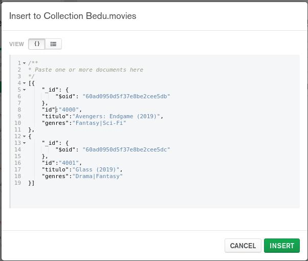
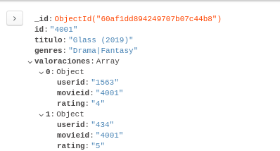
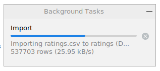
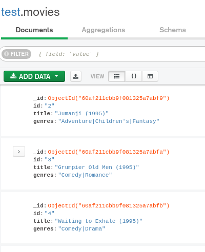
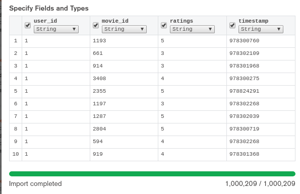

## Ejercicios Sesión 4

A continuación se realizarán algunas operaciones de agregar, modificar y eliminar un documento JSON en una Colección.

1. Agregar los siguientes registros en formato CSV a la Colección `movies`

   ```csv
   4000,Avengers: Endgame (2019),Fantasy|Sci-Fi
   4001,Glass (2019),Drama|Fantasy
   ```
   Incluyendo nombres de columnas quedaría:
   ```csv
   id,titulo,genres
   4000,Avengers: Endgame (2019),Fantasy|Sci-Fi
   4001,Glass (2019),Drama|Fantasy
   ```
   Y entonces el correspondiente formato JSON será:
   ```json
   {
     id:"4000",
     titulo:"Avengers: Endgame (2019)",
     genres:"Fantasy|Sci-Fi"
   }
   {
     id:"4001",
     titulo:"Glass (2019)",
     genres:"Drama|Fantasy"
   }
   ```

   

   Para poder observar nuestros documentos en la lista hay que realizar un filtro
   ```json
   {id: {$in: ["4000", "4001"]}}
   ```

2. Modificar el documento con `id=4001` en la Colección `movies` para que contenga la siguiente información:

   ```json
   {
     id:"4001",
     titulo:"Glass (2019)",
     genres:"Drama|Fantasy",
     valoraciones: [
       {
         userid: "1563",
         movieid: "4001",
         rating: "4"
       },
       {
         userid: "434",
         movieid: "4001",
         rating: "5"
       }
     ]
   }
   ```
   
## Reto 1: Realizando operaciones con tablas

1. Definir los campos y tipos de datos para la tabla `movies` haciendo uso de los archivos `movies.dat` y `README`.
2. Crear la tabla `movies` (recuerda usar el mismo nombre del archivo sin la extensión para vincular nombres de tablas con archivos).
```sql
 DROP TABLE IF EXISTS movies;
 CREATE TABLE movies (
    id INT PRIMARY KEY,
    title VARCHAR(80),
    genres VARCHAR(110)
);
```


3. Definir los campos y tipos de datos para la tabla `ratings` haciendo uso de los archivos `ratings.dat` y `README`.
4. Crear la tabla ratings (recuerda usar el mismo nombre del archivo sin la extensión para vincular nombres de tablas con archivos)
```sql
DROP TABLE IF EXISTS ratings;
CREATE TABLE ratings (
   user_id INT,
   movie_id INT,
   ratings INT,
   timestamp BIGINT,
   constraint fk_raitings_user foreign key (user_id) references users(id),
   constraint fk_raitings_movie foreign key (movie_id) references movies(id)
);
```
---

<br/>

## Reto 2: Importando datos a una tabla en formato CSV

1. Usando como base el archivo `movies.dat`, limpiarlo e importar los datos en la tabla `movies` creada en el Reto 1.
   > **Importante:** Este archivo presenta un problema muy común de *encoding*, es decir, la codificación con la que fue definido, no es reconocida por __MySQL__. Para solucionar este problema, elige una codificación diferente al momento de cargar los datos.
```
mysql root@localhost:Bedu> select count(*) as 'N. de Peliculas' from movies;                                                                       
+-----------------+
| N. de Peliculas |
+-----------------+
| 3882            |
+-----------------+
1 row in set
Time: 0.032s

mysql root@localhost:Bedu> select * from movies limit 5;                                                                                           
+----+------------------------------------+------------------------------+
| id | title                              | genres                       |
+----+------------------------------------+------------------------------+
| 2  | Jumanji (1995)                     | Adventure|Children's|Fantasy |
| 3  | Grumpier Old Men (1995)            | Comedy|Romance               |
| 4  | Waiting to Exhale (1995)           | Comedy|Drama                 |
| 5  | Father of the Bride Part II (1995) | Comedy                       |
| 6  | Heat (1995)                        | Action|Crime|Thriller        |
+----+------------------------------------+------------------------------+
5 rows in set
Time: 0.018s
```

1. Usando como base el archivo `ratings.dat`, limpiarlo e importar los datos en la tabla `ratings` creada en el Reto 2.   

   > **Importante:** Como podrás notar, este archivo tiene demasiados registros, de manera que es normal que la carga sea muy lenta. Esto es algo muy común cuando nos enfrentamos a la carga de archivos. Si ya lleva mucho tiempo y no finaliza, no te preocupes, puedes cancelar la carga.
   

1. Finalmente, añade un registro en cada tabla usando `INSERT INTO`.
```sql
insert into movies (id, title, genres)
values (3952, 'The House That Jack Built (2018)', 'horror');

insert into users (id, genero, edad, ocup, cp)
values (6041, 'M', 25, 10, 21440);

insert into ratings (user_id, movie_id, ratings, timestamp)
values (1, 2, 1, current_timestamp);
```

<br/>

## Reto 3: Realizando operaciones con Colecciones e importando datos

1. Crear la colección `movies`

2. Importar datos a la colección `movies` desde el archivo `movies.csv`



3. Crear la colección `ratings`

   Seleccionar la colección y continuar.

4. Importar datos a la colección `ratings` desde el archivo `ratings.csv`
   Validar que cada campo tenga nombre y que estén todos los campos, además valida la cantidad de documentos, que en este caso debería de ser 1000209 documentos.

  
