## Ejercicios Sesión 5

Las consultas se realizarán sobre la base `sample_training`.

Todas las consultas que realices deberás mantenerlas dentro del MongoDB Compass. Para hacer esto, da clic en el botón con los puntos `···` y en `Toogle Query History`. Busca la última consulta y agrégala a favoritos presionando el ícono con la estrella :star:.

1. Obtén los datos de contacto de cada compañía.
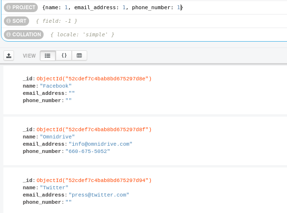

2. Obtén el identificador de la clase de cada calificación.
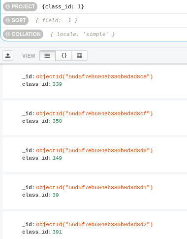

3. Obtén el nombre de todas las compañias fundadas en octubre.
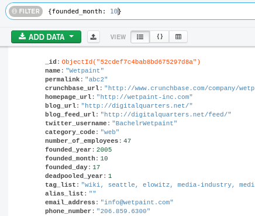

4. Obtén el nombre de todas las compañías fundadas en 2008.
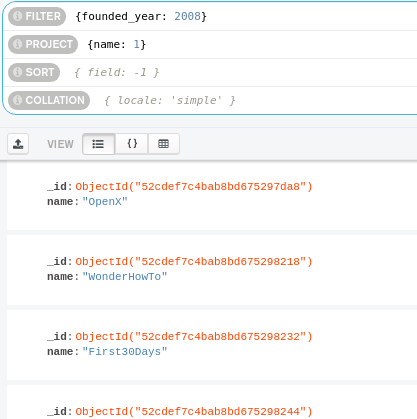

5. Obtén todos los *post* del autor `machine`.
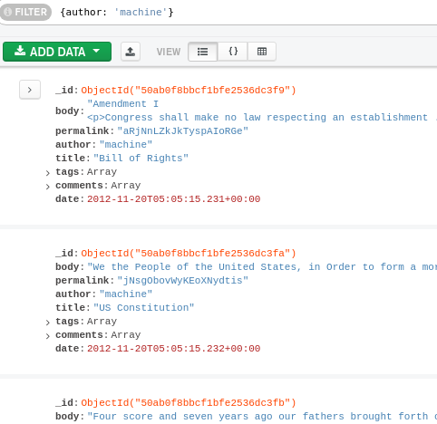

6. Obtén todas las calificaciones provenientes de los grupos `357`, `57` y `465`.
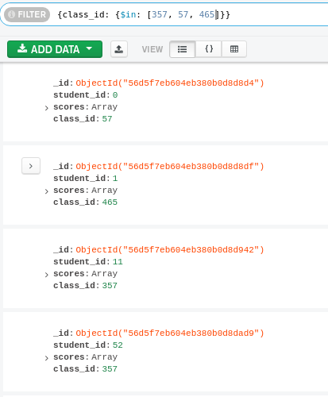

7. Obtén todas las compañías fundadas en octubre del 2008.
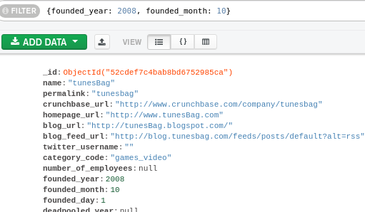

8. Obtén todas las compañias con más de 50 empleados. 
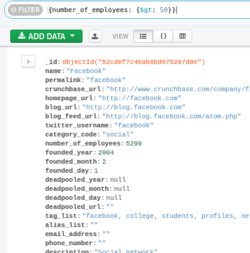

9. Obtén las rutas con un número de paradas entre 1 y 5.
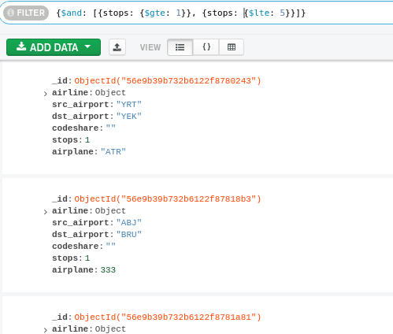

10. Obtén la empresa con el menor número de empleados.
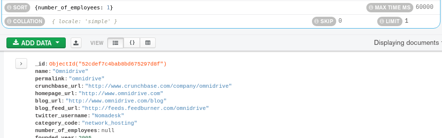

11. Obtén la empresa con el mayor número de empleados.

12. Obtén el viaje con mayor duración.
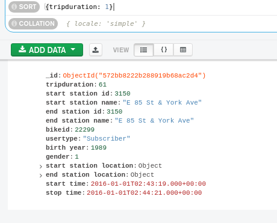

13. Obtén el viaje con menor duración.
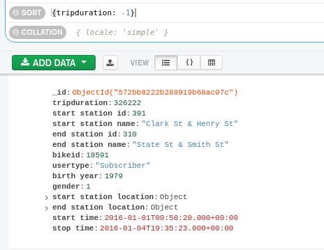

 

