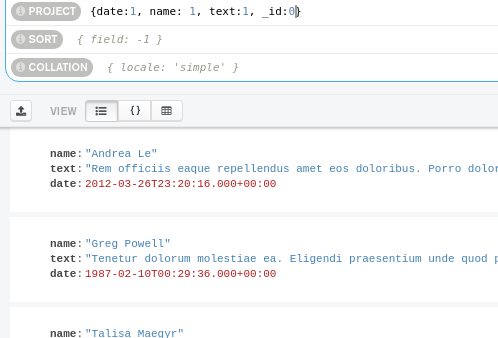
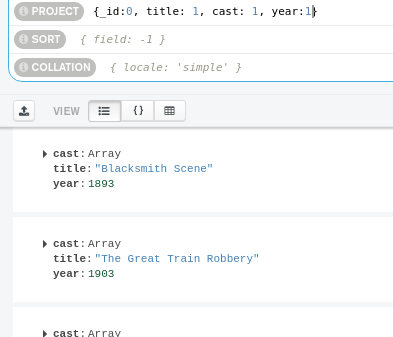
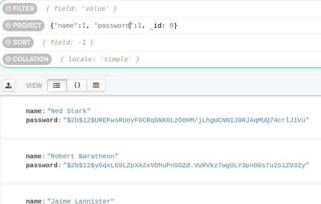
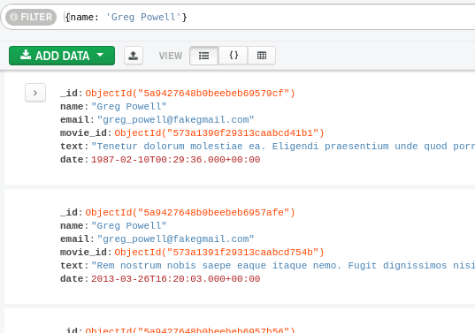
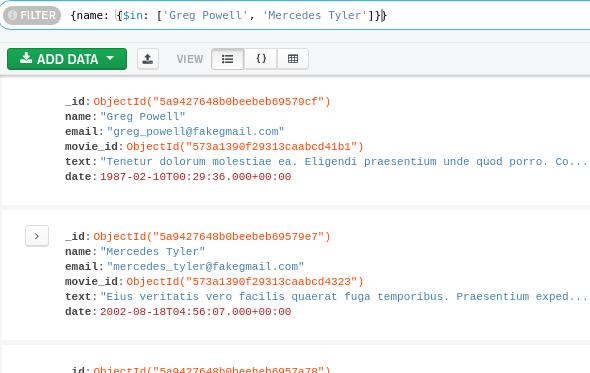
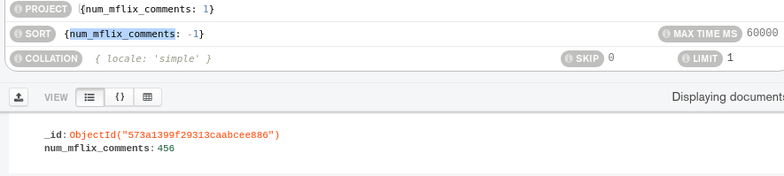

## Reto 1: Colecciones, Documentos y Proyecciones

Usando la base de datos `sample_mflix`, proyecta los datos que se solicitan.

- Fecha, nombre y texto de cada comentario.

- Título, elenco y año de cada película.

- Nombre y contraseña de cada usuario.

 

## Reto 2: Filtros básicos

Usando la base de datos `sample_mflix`, agrega proyeccciones, filtros, ordenamientos y límites que permitan contestar las siguientes preguntas:

- ¿Qué comentarios ha hecho Greg Powell?

- ¿Qué comentarios han hecho Greg Powell o Mercedes Tyler?

- ¿Cuál es el máximo número de comentarios en una película?

- ¿Cuál es título de las cinco películas más comentadas?

 

