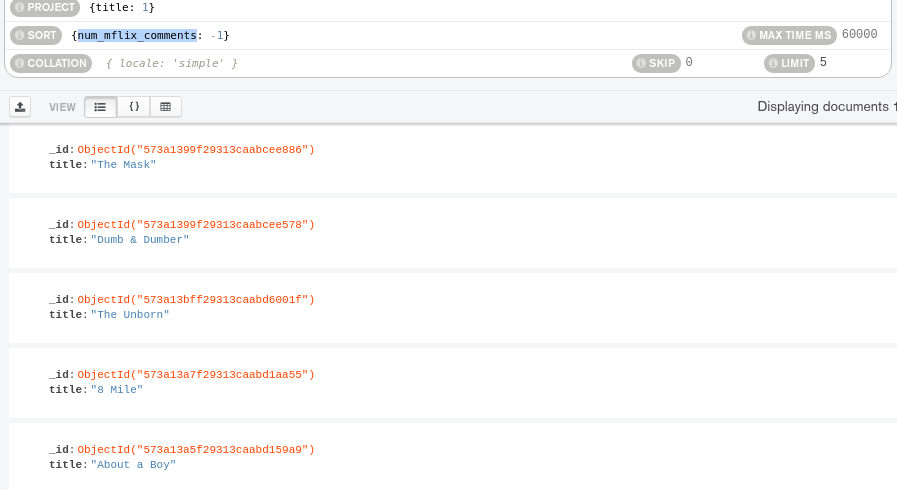

## Reto 1: Colecciones, Documentos y Proyecciones

Usando la base de datos `sample_mflix`, proyecta los datos que se solicitan.

- Fecha, nombre y texto de cada comentario.
 

 
- Título, elenco y año de cada película.
 

 
- Nombre y contraseña de cada usuario.
 

 

## Reto 2: Filtros básicos

Usando la base de datos `sample_mflix`, agrega proyeccciones, filtros, ordenamientos y límites que permitan contestar las siguientes preguntas:

- ¿Qué comentarios ha hecho Greg Powell?
 

 
- ¿Qué comentarios han hecho Greg Powell o Mercedes Tyler?
 

 
- ¿Cuál es el máximo número de comentarios en una película?
 

 
- ¿Cuál es título de las cinco películas más comentadas?
 

