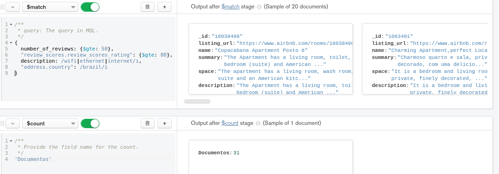

## Ejercicios Sesión 6

Para este ejercicio deberás practicar en el uso de agregaciones, pues serán usadas durante la siguiente sesión.

La base de datos y colección que debes usar es `sample_airbnb.listingsAndReviews`.

El ejercicio consiste en obtener todas las publicaciones que tengan 50 o más comentarios,
que la valoración sea mayor o igual a 80, que cuenten con conexión a Internet vía cable y estén ubicadas en Brazil.

 
