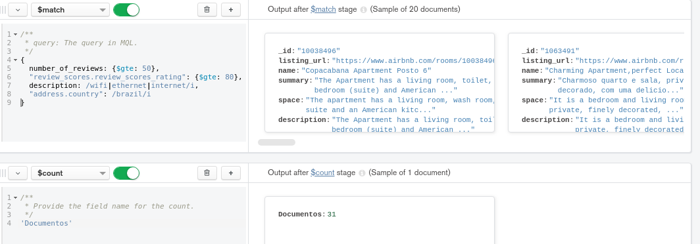
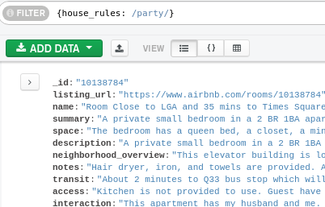
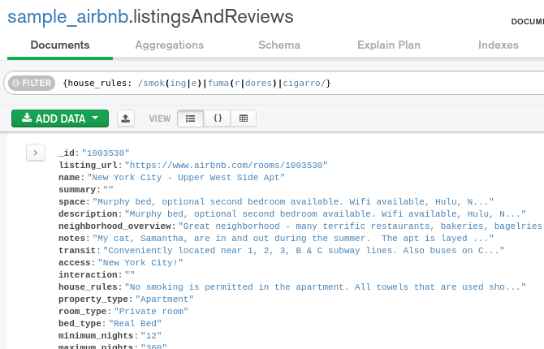

# Ejercicios Sesión 6

Para este ejercicio deberás practicar en el uso de agregaciones, pues serán usadas durante la siguiente sesión.

La base de datos y colección que debes usar es `sample_airbnb.listingsAndReviews`.

El ejercicio consiste en obtener todas las publicaciones que tengan 50 o más comentarios,
que la valoración sea mayor o igual a 80, que cuenten con conexión a Internet vía cable y estén ubicadas en Brazil.

 
# Retos Sesión 6
## Reto 1: Expresiones regulares

Usando la base de datos `sample_airbnb > listingsAndReviews`, realiza los siguientes filtros:

- Propiedades que no permitan fiestas.

- Propiedades que admitan mascotas.

- Propiedades que no permitan fumadores.

- Propiedades que no permitan fiestas ni fumadores.

 

	
## Reto 2: Notación punto y arreglos

Usando la colección `sample_airbnb.listingsAndReviews`, agrega un filtro que permita obtener todas las publicaciones que tengan 50 o más comentarios, que la valoración sea mayor o igual a 80, que cuenten con conexión a Internet vía cable y estén ubicada en Brazil.

	
## Reto 3: Introducción a las agregaciones

Usando la colección `sample_airbnb.listingsAndReviews`, mediante el uso de agregaciones, encontrar el número de publicaciones que tienen conexión a Internet, sea desde Wifi o desde cable (Ethernet).

 

