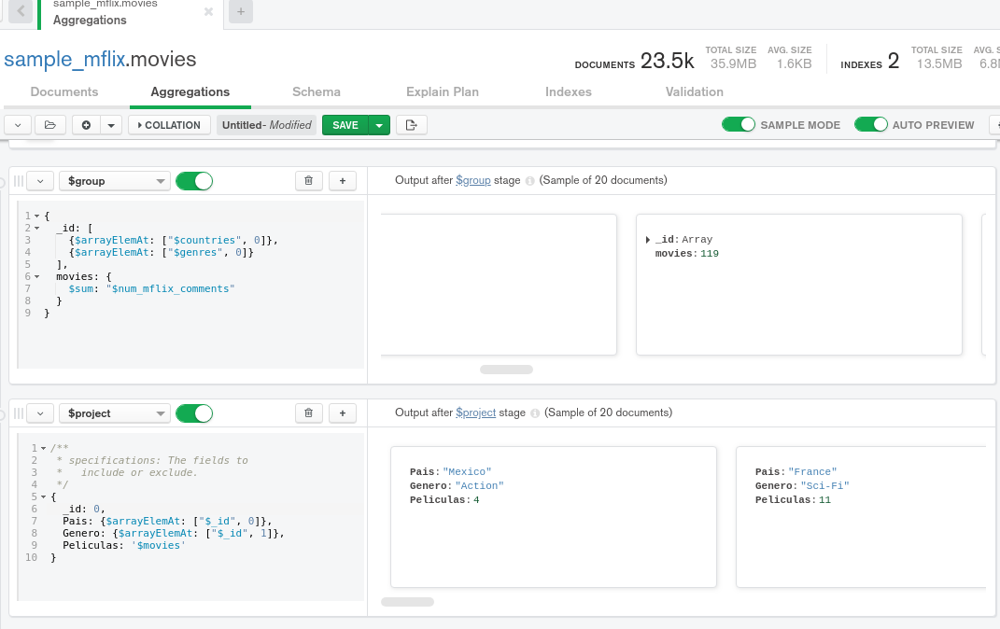

## Ejercicios Sesión 7

Continuaremos trabajando con la base de datos de películas y sus comentarios.

El ejercicio consiste en obtener, por país, el número de películas que hay de cada género.
Un ejemplo de salida, en formato de tabla, sería:

| pais | genero | peliculas |
| ---- | ------ | --------- |
| USA  | Short  | 10        |
| USA  | Drama  | 20        |
| ...  | ...    | ...       |

