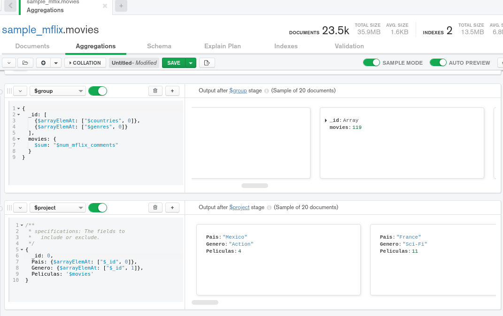

# Ejercicios Sesión 7

<div style="text-align: justify;">

Continuaremos trabajando con la base de datos de películas y sus comentarios.

El ejercicio consiste en obtener, por país, el número de películas que hay de cada género.
Un ejemplo de salida, en formato de tabla, sería:

| pais | genero | peliculas |
| ---- | ------ | --------- |
| USA  | Short  | 10        |
| USA  | Drama  | 20        |
| ...  | ...    | ...       |



# Retos Sesión 7

## Reto 1: Agrupamientos

<div style="text-align: justify;">

Con base en el ejemplo 1, modifica el agrupamiento para que muestre el costo promedio por habitación por país de las propiedades de tipo casa.


<br/>

## Reto 2: Asociación de colecciones

<div style="text-align: justify;">

Usando las colecciones `comments` y `users`, se requiere conocer el correo y contraseña de cada persona que realizó un comentario.
Construye un pipeline que genere como resultado estos datos.

#### $lookup
```bjson
{
  from: 'users',
  localField: 'email',
  foreignField: 'email',
  as: 'user'
}
```

#### $addFields
```bjson
{
  password: {$arrayElemAt: ["$user.password", 0]}
}
```

#### $project
```bjson
{
  _id: 0,
  email: 1,
  password: 1,
  text: 1
}
```

<br/>

</div>
	
## Reto 3: Generación de vistas

<div style="text-align: justify;">

Usando el *pipeline* que generaste en el Reto 2, genera la vista correspondiente.


</div>
